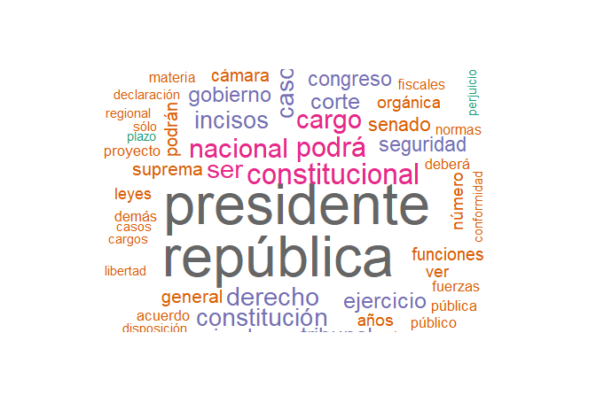
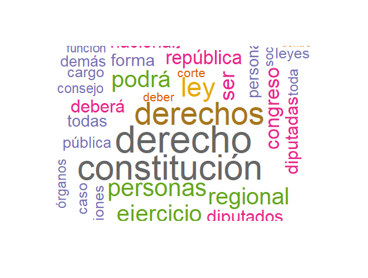

Ya publicada el borrador de la nueva constitución por la Convención Constitucional. Sin dudas se trata de un documento extenso por la gran cantidad de artículos aprobados. También se trata de un texto de enorme utilidad en tanto contiene redundancias que permiten, a veces a riesgo de la coherencia interna del texto, el análisis cuantitativo del borrador.

El objeto del ejercicio es aportar conceptos clave, que intencionen el análisis crítico y la difusión informada del proceso. Se busca comparar al borrador emanado por la Convención Constitucional con el texto constitucional Pinochet-Lagos.

## Palabras frente a palabras

Mediante nube de palabras se analizaron ambos textos, presentando las frecuencias de las palabras más utilizadas en cada constitución.


### Constitución de 1980 (Pinochet-Lagos)

En el caso de la constitución de 1980, se puede apreciar un sentido fuertemente procedimental. Predominando el lugar del **presidente de la república** y una serie dispositivos funcionales que permiten el desenvolvimiento de procedimental del texto constitucional.

Se trata de un texto donde donde predominan conceptos procedimentales, en su narrativa no se reitera principios rectores, más bien se encuentran implícitos. Sus énfasis se pueden observarsen en conceptos como ejercicio, suprema, incisos, constitucional, senado y congreso.



### Propuesta Borrador Convención Constitucional 2022

La propuesta emanada de la Convención, por su parte, arroja una serie de conceptos con mayor carga normativa, la idea de **derecho** y **derechos** presentan la mayor frecuencia de aparición en el texto, teniendo también preponderancia el concepto _personas_, sin por esto dejar de dialogár con palabras como _república_, _regional_, _diputadas_ y _diputados_.



## Correlaciones de conceptos y palabras.

La correlación de palabras permite conocer qué palabras se encuentran más cercanas a otras en el texto, estableciendo asociaciones a partir de conceptos clave que nos interesa conocer.

### Constitución de 1980 (Pinochet-Lagos)


```{r, echo=FALSE, message=FALSE, warning=FALSE}
library(tidyverse)
library(xml2)
library(openxlsx)
library(readxl) 
library(readr)
library(cluster)
library(tm)
library(wordcloud)
library(Rcpp)
library(SnowballC) 

#cargamos el texto
nov_text1 <-read_lines("images/constitucion_politica.txt")

# LIPIEZA -----
#expresiones regulares
nov_text1 <- gsub("[[:cntrl:]]", " ", nov_text1)

#minúsculas
nov_text1 <- tolower(nov_text1)

#stopwords
nov_text1 <- removeWords(nov_text1, words = stopwords("spanish"))

#puntuación
nov_text1 <- removePunctuation(nov_text1)


#numeros
nov_text1 <- removeNumbers(nov_text1)

#vacíos excesivos

nov_text1 <- stripWhitespace(nov_text1)

nov_text1 <- removeWords(nov_text1, words = c("por", "que", "ley.", "artículo",
                                            "así", "dijo", "para", "sin", "del",
                                            "1°", "19", "4°", "3°", "inciso", "ley",
                                            "dos", "días", "letra"))

#corpus
nov_corpus1 <- VCorpus(VectorSource(nov_text1)) 
nov_ptd1 <- nov_corpus1 %>% tm_map(PlainTextDocument)
nov_tdm1 <- TermDocumentMatrix(nov_ptd1)

nov_corpus1 <- VCorpus(VectorSource(nov_text1)) 
nov_ptd1 <- nov_corpus1 %>% tm_map(PlainTextDocument)
nov_tdm1 <- TermDocumentMatrix(nov_ptd1)

#correlaciones
findAssocs(nov_tdm1, terms = c("libertad","igualdad", "dignidad", "solidario",
                              "solidaridad",
                              "derecho", "derechos","mujeres", "hombres",
                              "propiedad", "oportunidades", "mercado",
                              "individuos", "pueblos", "oprimidos",
                              "expropiación", "educación", "vivienda",
                              "educadores","profesores", "profesoras",
                              "economía", "minería", "patrimoniales", "patrimonio",
                              "sindicales", "sindical", "trabajadores"),
           corlimit = .30)

```


### Propuesta Borrador Convención Constitucional 2022


```{r, echo=FALSE, message=FALSE, warning=FALSE}
library(tidyverse)
library(xml2)
library(openxlsx)
library(readxl) 
library(readr)
library(cluster)
library(tm)
library(wordcloud)
library(Rcpp)
library(SnowballC) 

#cargamos el texto
nov_text1 <-read_lines("images/Borrador Constitucion.txt")

# LIPIEZA -----
#expresiones regulares
nov_text1 <- gsub("[[:cntrl:]]", " ", nov_text1)

#minúsculas
nov_text1 <- tolower(nov_text1)

#stopwords
nov_text1 <- removeWords(nov_text1, words = stopwords("spanish"))

#puntuación
nov_text1 <- removePunctuation(nov_text1)


#numeros
nov_text1 <- removeNumbers(nov_text1)

#vacíos excesivos

nov_text1 <- stripWhitespace(nov_text1)

nov_text1 <- removeWords(nov_text1, words = c("por", "que", "ley.", "artículo",
                                            "así", "dijo", "para", "sin", "del",
                                            "1°", "19", "4°", "3°", "inciso", "ley",
                                            "dos", "días", "letra"))

#corpus
nov_corpus1 <- VCorpus(VectorSource(nov_text1)) 
nov_ptd1 <- nov_corpus1 %>% tm_map(PlainTextDocument)
nov_tdm1 <- TermDocumentMatrix(nov_ptd1)

nov_corpus1 <- VCorpus(VectorSource(nov_text1)) 
nov_ptd1 <- nov_corpus1 %>% tm_map(PlainTextDocument)
nov_tdm1 <- TermDocumentMatrix(nov_ptd1)

#correlaciones
findAssocs(nov_tdm1, terms = c("libertad","igualdad", "dignidad", "solidario",
                              "solidaridad",
                              "derecho", "derechos","mujeres", "hombres",
                              "propiedad", "oportunidades", "mercado",
                              "individuos", "pueblos", "oprimidos",
                              "expropiación", "educación", "vivienda",
                              "educadores","profesores", "profesoras",
                              "economía", "minería", "patrimoniales", "patrimonio",
                              "sindicales", "sindical", "trabajadores"),
           corlimit = .30)

```


